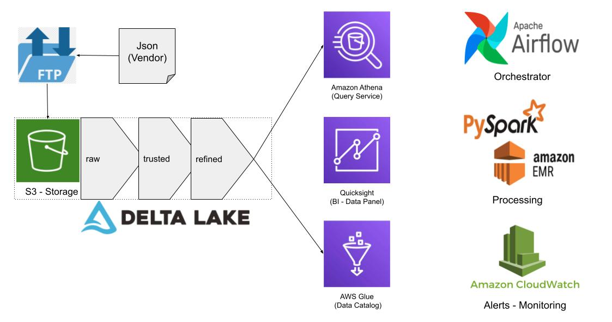

## Data Engineering 
This code was created to demonstrate my skills with Python and Spark.

There are two sources of data:
- Internal data (movies and streams) in CSV format. They simulate data that could be obtained from a relational database (JDBC connection or CDC tool)
- External data from vendors (authors, books and reviews) in JSON format

Two ETLs were developed to transform these raw data into enriched and processed data for analysis purposes.

## Local Setup
Execute the script below, it will create a virtualenv and install the necessary dependencies.

Note: you should have `python 3`, `pip` and `virtualenv` previously installed

If you don't have, do the installation:
``` bash
$ sudo apt-get install python3.8-dev python3.8-venv
```

Python
https://www.python.org/downloads/release/python-3914/


``` bash
$ make venv
$ source src/venv/bin/activate
$ make install
```

## Makefile
Contains commands used in everyday life.


## Troubleshooting:

1. If you have any trouble with "ModuleNotFoundError: No module named ", you can add the pythonpath environment variable:

``` bash
 $ export PYTHONPATH=$PYTHONPATH:src
```

### Database migration
It's necessary to run the database migration script that will create the tables:

``` bash
 $ make db-migration
```
(Please check troubleshooting if "ModuleNotFoundError appears)

Then you can run the ETL
``` bash
 $ make execute-etl
```
(Please check troubleshooting if "ModuleNotFoundError appears)

## Intentional Data Architecture solution 


In general terms, the main change to turn this example code into a prodction solution, would be to change the approach from ETL to ELT, creating data pipelines and structuring a data lake.

This change would bring significant advantages, being able to store structured and unstructured data, would allow to enrich the dataset and establish data governance.
The final zone of the datalake (refined) would be integrated with AWS Athena, enabling interactive queries and facilitating data access in an easy way with SQL.

Data quality would be applied to the trusted layer. A data catalog would be created with AWS Glue data catalog.

- Cloud:
  - Amazon AWS: AWS is a very good cloud and is used all over the world. It has interesting and easy to use tools that will be detailed below. Despite this, the development core is cloud agnostic and can be migrated without complications.
- Storage:
  - Amazon S3: Amazon S3 is an object storage service from AWS that offers  industry-leading scalability, data availability, security, and performance.
  - Zones of a data lake 
    - **Raw:** In the raw zone data is moved in its native format, without transformation or binding to any business rules. The JSON files from vendors would reach this zone.
    - **Trusted:** Data allocated in this zone have already been processed, underwent the necessary transformations to be consumed and already have Data Quality guarantees, and can be considered accurate and reliable.
    - **Refined:** In the Refined Zone it is possible to find processed and enriched data, ready to be consumed by external applications.
- Delta Lake: 
  - Delta Lake is an open source storage layer that brings reliability to data lakes. Delta was chosen because the usability is very easy and guarantees effortless ACID transactions. It is compatible with different architectures and tools (lakehouses, lakes, hive, aws athena, among others..
- Data Catalog:
  - AWS Glue Data Catalog: It's a amazing option. I would use crawlers to populate the aws glue data catalog with tables.
- Query Service:
  - Amazon Athena: Amazon Athena is an interactive query service that makes it easy to analyze data in Amazon S3 using standard SQL. Athena is serverless, so there is no infrastructure to manage, and you pay only for the queries that you run. Athena has native integration and works very well with Delta Tables stored at storage S3
- Orchestrator:
  - Apache Airflow: Airflow uses directed acyclic graphs (DAGs) to manage workflow orchestration. Tasks and dependencies are defined in Python and then Airflow manages the scheduling and execution. DAGs can be run either on a defined schedule (e.g. hourly or daily) or based on external event triggers 
- Monitoring:
  - Amazon CloudWatch: CloudWatch collects monitoring and operational data in the form of logs, metrics, and events, and visualizes it using automated dashboards so you can get a unified view of the AWS resources
- Tests:
  - Pytest: The pytest framework makes it easy to write small, readable tests, and can scale to support complex functional testing data pipelines
- BI - Data Panel:
  - Quicksight: Amazon QuickSight allows everyone in the organization to understand your data by asking questions in natural language, exploring through interactive dashboards, or automatically looking for patterns and outliers powered by machine learning.


